# Domain Model Specification
## Project: CUANIMUS — Core Quantitative Trading Domain

- **Document Version:** 1.0.0
- **Date:** 2026-10-03
- **Status:** APPROVED

---

## 1. Domain Overview & Invariants

The **CUANIMUS** domain model enforces domain boundaries using strongly typed value objects and entity lifecycles. 

### Core Domain Invariants:
1. **Immutable Market Data:** Market data snapshots (`MarketFrame`) cannot be mutated by strategy or risk components.
2. **Intent vs Order Separation:** A Strategy produces a `TradeIntent` (a hypothesis), never an `Order` (an obligation).
3. **Risk Gating Invariant:** No `OrderRequest` can be created or dispatched without traversing the `RiskEngine.evaluate()` gate.
4. **Finite Order State Transitions:** An order can only transition through explicitly defined states in the `OrderState` enumeration.

---

## 2. Ubiquitous Language & Core Entities

```mermaid
classDiagram
    class MarketFrame {
        +String symbol
        +String timeframe
        +DateTime timestamp
        +DataFrame candles
        +Float mark_price
        +Float funding_rate
    }

    class TradeIntent {
        +String intent_id
        +String symbol
        +SignalDirection direction
        +Float suggested_entry
        +String strategy_id
        +Dict features_snapshot
    }

    class RiskEvaluation {
        +Boolean is_approved
        +String veto_reason
        +Float approved_stake
        +Float approved_leverage
        +Float stop_loss_price
        +Float take_profit_price
        +Float risk_amount_usdt
    }

    class OrderRequest {
        +String client_order_id
        +String symbol
        +OrderSide side
        +OrderType order_type
        +Float amount
        +Float price
        +Float stop_loss
        +Int leverage
    }

    class Order {
        +String client_order_id
        +String exchange_order_id
        +OrderState state
        +Float filled_amount
        +Float remaining_amount
        +Float average_fill_price
        +Float fee_paid
        +DateTime created_at
        +DateTime updated_at
    }

    class Position {
        +String position_id
        +String symbol
        +PositionSide side
        +Float size
        +Float entry_price
        +Float current_stop_loss
        +Float unrealized_pnl
        +Float realized_pnl
        +Int leverage
    }

    MarketFrame --> TradeIntent : evaluated by Strategy
    TradeIntent --> RiskEvaluation : appraised by RiskEngine
    RiskEvaluation --> OrderRequest : generates if approved
    OrderRequest --> Order : executed by ExecutionEngine
    Order --> Position : fills into / updates
```



---

## 3. Strongly Typed Python Domain Contracts (Interface Signatures)

```python
from dataclasses import dataclass, field
from datetime import datetime
from enum import Enum
from typing import Dict, Any, Optional

class SignalDirection(str, Enum):
    LONG = "LONG"
    SHORT = "SHORT"
    HOLD = "HOLD"
    EXIT_LONG = "EXIT_LONG"
    EXIT_SHORT = "EXIT_SHORT"

class MarketRegimeType(str, Enum):
    TRENDING_BULL = "TRENDING_BULL"
    TRENDING_BEAR = "TRENDING_BEAR"
    RANGING = "RANGING"
    HIGH_VOLATILITY = "HIGH_VOLATILITY"
    LOW_VOLATILITY = "LOW_VOLATILITY"
    UNCERTAIN = "UNCERTAIN"

class OrderState(str, Enum):
    CREATED = "CREATED"
    SUBMITTED = "SUBMITTED"
    PARTIALLY_FILLED = "PARTIALLY_FILLED"
    FILLED = "FILLED"
    CANCELLING = "CANCELLING"
    CANCELLED = "CANCELLED"
    REJECTED = "REJECTED"
    EXPIRED = "EXPIRED"
    FAILED = "FAILED"

@dataclass(frozen=True)
class TradeIntent:
    intent_id: str
    symbol: str
    direction: SignalDirection
    timestamp: datetime
    strategy_id: str
    features: Dict[str, float]
    suggested_stop_loss: Optional[float] = None
    confidence: float = 1.0

@dataclass(frozen=True)
class RiskEvaluation:
    is_approved: bool
    veto_reason: Optional[str]
    approved_stake: float
    approved_leverage: float
    stop_loss_price: float
    take_profit_price: Optional[float]
    max_loss_usdt: float
    timestamp: datetime = field(default_factory=datetime.utcnow)

@dataclass
class Order:
    client_order_id: str
    symbol: str
    side: str
    order_type: str
    amount: float
    price: float
    state: OrderState
    exchange_order_id: Optional[str] = None
    filled: float = 0.0
    remaining: float = 0.0
    average_fill_price: Optional[float] = None
    fee_cost: float = 0.0
    created_at: datetime = field(default_factory=datetime.utcnow)
    updated_at: datetime = field(default_factory=datetime.utcnow)
```
