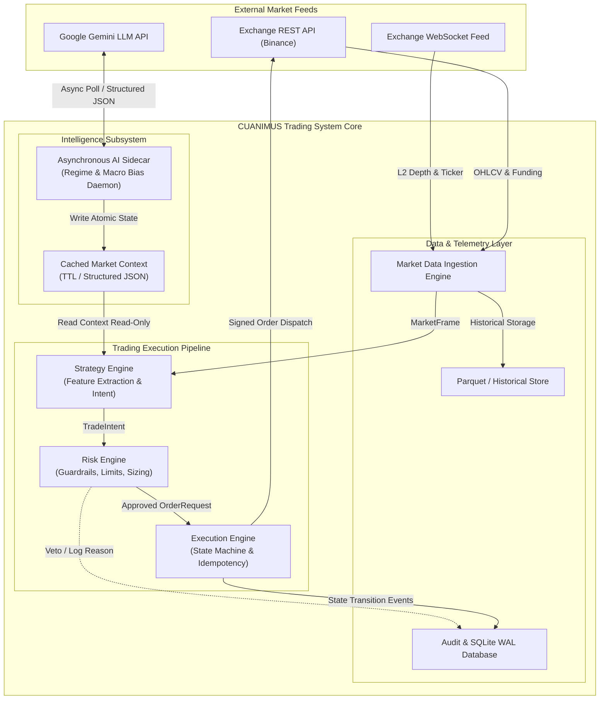

# Software Architecture Document (SAD)
## Project: CUANIMUS — Modular Quantitative Crypto Trading Platform

- **Document Version:** 1.0.0
- **Date:** 2026-10-03
- **Status:** APPROVED / BASELINE ARCHITECTURE
- **Architectural Paradigm:** Clean Architecture / Hexagonal Ports & Adapters, Event-Driven, Deterministic Execution
- **System Classification:** Quantitative Derivatives Execution & Risk Engine

---

## 1. Architectural Drivers & Goals

The primary goal of the **CUANIMUS** architecture is to transition from a monolithic strategy script with embedded execution and risk logic to an enterprise-grade, open-source quantitative trading platform designed under the following non-negotiable principles:

1. **Strict Separation of Concerns:**
   - Strategy generates **Trade Intents** (signals).
   - Risk Engine performs **Risk Assessment & Position Sizing** (holds absolute veto power).
   - Execution Engine manages **Deterministic Order Lifecycles & State Reconciliation**.
2. **Determinism & Reproducibility:**
   - Given identical market state data and configuration, the system must produce identical execution decisions.
3. **Decoupled Intelligence Layer:**
   - External LLMs (e.g., Google Gemini) and on-chain intelligence run strictly as **asynchronous sidecars** with bounded Time-To-Live (TTL) and zero impact on event-loop latency.
4. **Security by Design:**
   - Zero-secret persistence in codebase; configuration isolation between Dry-Run and Live environments.

---

## 2. High-Level System Architecture (C4 Container View)



---

## 3. Core Component Decomposition & Responsibilities

### 3.1 Market Data Engine (`cuanimus.data`)
- **Responsibility:** Ingesting, cleaning, normalizing, and storing multi-timeframe OHLCV, funding rates, open interest, and Level-2 order book depth.
- **Contract:** Emits immutable `MarketFrame` snapshots. Strictly isolates higher timeframe (HTF) candle availability to avoid lookahead bias.

### 3.2 Strategy Engine (`cuanimus.strategy`)
- **Responsibility:** Consumes `MarketFrame` and optional `RegimeContext`; computes technical indicators and feature combinations (Trend, Momentum, Volatility, Volume, Pullback); emits a typed `TradeIntent`.
- **Constraint:** Pure function. **MUST NOT** interact with exchange APIs, wallet balances, or position sizing formulas.

### 3.3 Risk Engine (`cuanimus.risk`)
- **Responsibility:** Independent gatekeeper of capital. Evaluates account equity, active exposure, correlation, daily drawdown, volatility (ATR), and stop-distance sizing.
- **Authority:** Absolute veto over `TradeIntent`. If approved, converts `TradeIntent` into an `OrderRequest` with precise position size and stop-loss level.

### 3.4 Execution Engine (`cuanimus.execution`)
- **Responsibility:** Deterministic state machine governing order submission, partial fills, cancellations, timeouts (`unfilledtimeout`), and post-restart exchange state reconciliation.
- **Guarantees:** Idempotency via deterministic `clientOrderId`, slippage monitoring, and active detection of orphaned/zombie orders.

### 3.5 Intelligence Sidecar (`cuanimus.intelligence`)
- **Responsibility:** Asynchronous background process querying macro market sentiment or Gemini 2.0 Flash for multi-timeframe contextual analysis.
- **Guarantees:** Non-blocking to core execution; structured JSON Schema validation; automatic fallback when API latencies or errors occur.

---

## 4. Pipeline Execution Flow

The deterministic execution sequence for every candle tick follows a strict four-stage pipeline:

```
MarketFrame 
    │
    ▼
[Stage 1: Strategy Signal Generation] ──> Emits TradeIntent (Direction, Entry Price, Reason)
    │
    ▼
[Stage 2: Risk Assessment & Sizing]   ──> Evaluates Drawdown, Correlation, ATR Stop, Sizes Position
    │
    ├── VETOED  ──> Log Veto Reason & Terminate Pipeline
    └── APPROVED
         │
         ▼
[Stage 3: Execution Order Dispatch]   ──> Dispatches Idempotent Order to Exchange State Machine
         │
         ▼
[Stage 4: Post-Trade Audit & Telemetry] ──> Emits Metrics, Logs Event, Persists to SQLite WAL
```

---

## 5. Security & Deployment Architecture

- **Secrets Management:** Environment variables loaded via validated `.env` files; API keys are never written to disk or configuration dumps.
- **Container Isolation:** Multi-stage Docker build packaging unprivileged execution (`ftuser`), read-only root filesystems where practical, and persistent database volumes mounted at `/freqtrade/user_data/`.
- **High Availability & Fault Recovery:** Startup sequence always performs an active exchange order book reconciliation before resuming trading logic.
