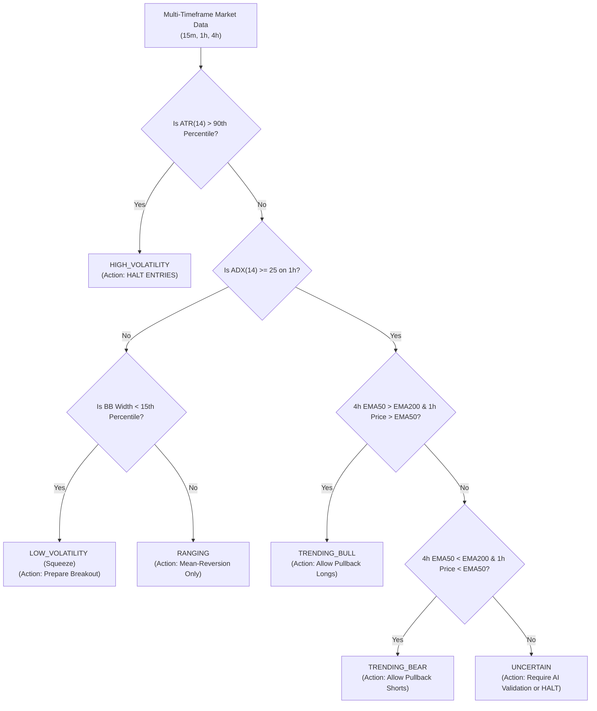
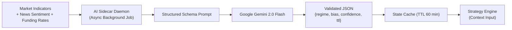

# Market Regime & Multi-Timeframe Specification
## Project: CUANIMUS — Context-Aware Signal Architecture

- **Document Version:** 1.0.0
- **Date:** 2026-10-03
- **Status:** APPROVED

---

## 1. Market Regime Classification

Trading algorithms that apply trend-following breakout entries into ranging markets inevitably bleed capital through consecutive stop outs (as proven by the V0 Baseline's 13 consecutive losses). The **Market Regime Engine** classifies market dynamics into 6 discrete states:

```
┌────────────────────────────────────────────────────────────────────────┐
│                        MARKET REGIME TAXONOMY                          │
├───────────────────┬────────────────────────────────────────────────────┤
│ 1. TRENDING_BULL  │ Directional upward momentum, expanding volume.     │
│ 2. TRENDING_BEAR  │ Directional downward momentum, expanding volume.   │
│ 3. RANGING        │ Mean-reverting sideways price channel, low ADX.   │
│ 4. HIGH_VOLATILITY│ Erratic wide wicks, ATR > 90th percentile, chop.   │
│ 5. LOW_VOLATILITY │ Squeeze / Compression, ATR < 20th percentile.      │
│ 6. UNCERTAIN      │ Conflicting indicators across timeframes.          │
└───────────────────┴────────────────────────────────────────────────────┘
```

---

## 2. Quantitative Classification Matrix



### 2.1 Quantitative Rules & Thresholds

| Regime | Mathematical Condition | Strategy Gating Action |
| :--- | :--- | :--- |
| **`TRENDING_BULL`** | $ADX_{1h} \ge 25 \land EMA50_{4h} > EMA200_{4h} \land Close_{1h} > EMA50_{1h}$ | **Enable LONG signals only** (on 15m pullback). Reject SHORT. |
| **`TRENDING_BEAR`** | $ADX_{1h} \ge 25 \land EMA50_{4h} < EMA200_{4h} \land Close_{1h} < EMA50_{1h}$ | **Enable SHORT signals only** (on 15m pullback). Reject LONG. |
| **`RANGING`** | $ADX_{1h} < 20 \land |Close - VWAP| < 1.0 \times \sigma$ | **Reject all trend breakouts**. Enable mean-reversion grid. |
| **`HIGH_VOLATILITY`**| $ATR_{15m} > \text{Quantile}_{90}(ATR_{15m}, 1000\text{ bars})$ | **HALT all new entries**. Wide wicks invalidate technical levels. |
| **`LOW_VOLATILITY`** | $\text{Bollinger Bandwidth}_{1h} < \text{Quantile}_{15}$ | Inhibit entries; wait for directional volatility expansion. |
| **`UNCERTAIN`** | Indicator signals contradict across timeframes. | Default to capital preservation: **Veto trade**. |

---

## 3. Multi-Timeframe Alignment (MTF Architecture)

The architecture treats multi-timeframe resolution as a **configurable, testable hypothesis**, not an assumed truth:

```text
┌────────────────────────────────────────────────────────┐
│ 4h Macro Horizon: Market Structure, EMA200, Bull/Bear │
├────────────────────────────────────────────────────────┤
│ 1h Intermediate Horizon: Regime Gating & Trend Strength│
├────────────────────────────────────────────────────────┤
│ 15m Execution Horizon: Pullback Reversal, Entry / Exit │
└────────────────────────────────────────────────────────┘
```

### 3.1 Strict Anti-Lookahead Synchronization Rule
When computing indicators on a higher timeframe (e.g. 1h) while trading on 15m:
- A 1h candle opening at `10:00:00` is **NOT** available to the 15m execution loop until `11:00:00.000` (after the 1h candle has closed).
- Data pipelines enforce right-alignment: `df_15m.merge(df_1h.shift(1))` to guarantee zero lookahead bias during backtests.

---

## 4. Role of AI in Regime & Market Context

The LLM (Gemini 2.0 Flash) is strictly an **Advisory Intelligence Provider**, never an execution authority:



### 4.1 Schema Contract for AI Output
```json
{
  "$schema": "http://json-schema.org/draft-07/schema#",
  "type": "object",
  "properties": {
    "macro_bias": { "type": "string", "enum": ["BULLISH", "BEARISH", "NEUTRAL"] },
    "detected_regime": { "type": "string", "enum": ["TRENDING", "RANGING", "VOLATILE"] },
    "confidence_score": { "type": "integer", "minimum": 0, "maximum": 100 },
    "volatility_risk": { "type": "string", "enum": ["LOW", "MEDIUM", "HIGH"] },
    "rationale": { "type": "string", "maxLength": 100 },
    "valid_until_utc": { "type": "string", "format": "date-time" }
  },
  "required": ["macro_bias", "detected_regime", "confidence_score", "valid_until_utc"]
}
```

### 4.2 Graceful Degradation Invariant
If the AI Sidecar fails, times out, or returns data past `valid_until_utc`, the Strategy Engine **automatically falls back to deterministic technical rules** with zero latency disruption.
