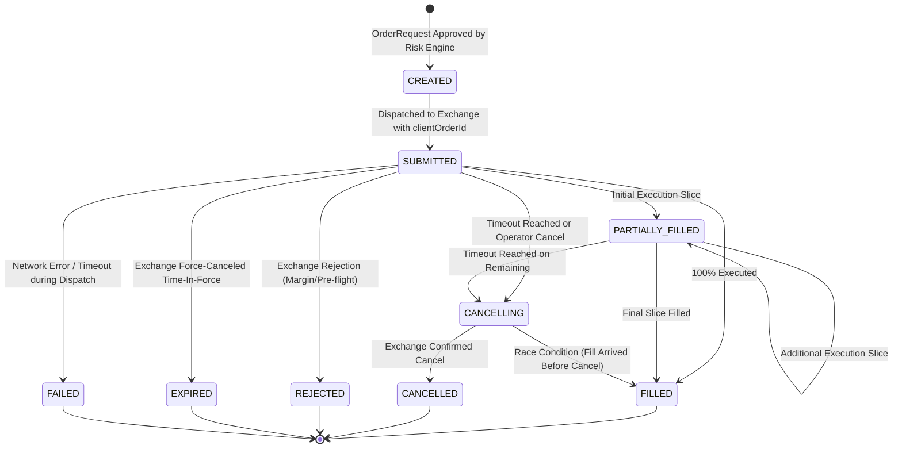

# Order Lifecycle & State Machine Specification
## Project: CUANIMUS — Deterministic Execution Engine

- **Document Version:** 1.0.0
- **Date:** 2026-10-03
- **Status:** APPROVED

---

## 1. State Machine Definition

To eliminate unhandled order conditions (such as Trade #529 hanging unfilled for 45 days in the V0 baseline), all orders in CUANIMUS follow a formal, deterministic finite-state machine (FSM):



---

## 2. Order States & Transition Invariants

| State | Definition | Permitted Next States |
| :--- | :--- | :--- |
| **`CREATED`** | Order object instantiated in memory with unique `clientOrderId`. | `SUBMITTED`, `FAILED` |
| **`SUBMITTED`** | Cryptographically signed payload sent to exchange; awaiting ACK. | `FILLED`, `PARTIALLY_FILLED`, `CANCELLING`, `REJECTED`, `FAILED` |
| **`PARTIALLY_FILLED`**| Fraction of order executed ($0 < \text{filled} < \text{amount}$). Stop loss initialized for filled amount. | `PARTIALLY_FILLED`, `FILLED`, `CANCELLING` |
| **`FILLED`** | $100\%$ of requested contracts filled. Active position created. | Terminal State |
| **`CANCELLING`** | Cancel request dispatched to exchange; waiting for ACK. | `CANCELLED`, `FILLED` (fill race condition) |
| **`CANCELLED`** | Order terminated with 0 remaining contracts. Any unfilled slot released. | Terminal State |
| **`REJECTED`** | Exchange returned error code (insufficient margin, lot size, etc.). | Terminal State |
| **`EXPIRED`** | Order reached `unfilledtimeout` and was successfully expired. | Terminal State |
| **`FAILED`** | Network socket dropped without response; triggers reconciliation check. | Terminal State |

---

## 3. Mandatory Execution Mechanics

### 3.1 Idempotency & Unique Client Order IDs
Every order dispatched to the exchange embeds a deterministic, collision-free `clientOrderId`:
```text
clientOrderId = "CNMS_" + {strategy_id[:4]} + "_" + {symbol_hash[:4]} + "_" + {epoch_ms} + "_" + {uuid_hex[:6]}
```
*Purpose:* If a network timeout occurs while transmitting an order, retrying with the identical `clientOrderId` guarantees the exchange will reject duplicates rather than double-filling.

### 3.2 Unfilled Order Timeout Guard (`unfilledtimeout`)
- **Root Cause of Baseline Flaw:** Trade #529 on XRP was opened on 2026-08-19 as a limit buy. The market moved away immediately. Because no timeout was enforced, the order remained active in memory for 1.5 months, tying up 1 of 3 trade slots.
- **Rule:** Every pending limit order is assigned an expiration deadline:
  \[
  T_{\text{expire}} = T_{\text{submission}} + \Delta t_{\text{timeout}} \quad (\text{Default: } 10\text{ minutes})
  \]
- When $T_{\text{current}} \ge T_{\text{expire}}$ and the order is still `SUBMITTED`, the state machine transitions to `CANCELLING` and emits an exchange cancellation request. Once confirmed, the trade slot is freed immediately.

### 3.3 Partial Fill Position Management
When an order transitions to `PARTIALLY_FILLED`:
1. The local position record is credited with the exact `filled_amount`.
2. A protective stop-loss order is immediately registered for the *currently filled quantity* (not the full requested quantity) to eliminate unprotected exposure.
3. If the remainder is canceled by `unfilledtimeout`, the remaining unfilled slice is pruned and the position remains open at the partial size.

### 3.4 Startup Reconciliation & Stale Order Detection
Upon application boot or reconnection:
1. Engine calls `fetch_open_orders()` across all whitelist pairs.
2. Orders found on exchange but absent from local database are categorized as **Orphaned Orders** $\rightarrow$ Logged at `CRITICAL` severity and operator-notified.
3. Orders found in local database as `SUBMITTED` but absent from exchange are reconciled against `fetch_my_trades()` to determine whether they filled during downtime or expired.
