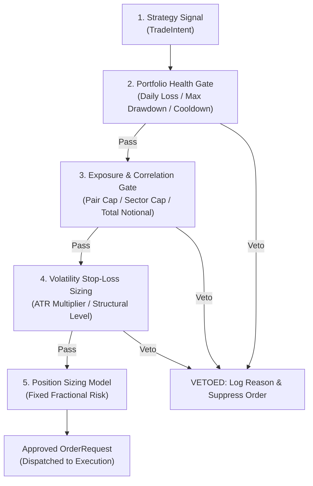

# Risk Engine Specification
## Project: CUANIMUS — Autonomous Capital Preservation System

- **Document Version:** 1.0.0
- **Date:** 2026-10-03
- **Status:** APPROVED

---

## 1. Core Principle & Authority Hierarchy

> **"Risk Engine is completely independent of Strategy and holds absolute veto authority over all trade generation."**

Under the CUANIMUS architecture, a strategy can only suggest an opportunity (`TradeIntent`). The **Risk Engine** acts as the portfolio fiduciary, verifying that the proposed risk does not breach any capital protection invariants.



---

## 2. Guardrails & Circuit Breakers

### 2.1 Max Daily Loss Limit
- **Rule:** If realized losses + open unrealized losses within a rolling 24-hour UTC window exceed **3.0% of start-of-day equity**, all new entries are halted for 24 hours. Open positions are managed strictly by their trailing stop losses.

### 2.2 Maximum Portfolio Drawdown Guard
- **Rule:** If the equity curve experiences a drawdown from high-water mark $> 10.0\%$, the system enters **Safe Mode**:
  - Maximum leverage is reduced to $2\text{x}$.
  - Risk per trade is halved (from $1.0\%$ to $0.5\%$).
  - If drawdown exceeds $15.0\%$, all automated entries are suspended until manual administrative override.

### 2.3 Consecutive-Loss Protection & Cooldown
- **Empirical Rationale:** The V0 Baseline exhibited a streak of **13 consecutive losses** between September and October 2026 due to repeated false breakouts in choppy markets.
- **Rule:**
  - After **3 consecutive losses** on a specific pair: Apply a mandatory **4-hour cooldown** on that pair.
  - After **5 consecutive losses across the portfolio**: Halt all entries for **12 hours** to allow the market regime to transition.

### 2.4 Correlation & Notional Exposure Limits
- **Pair Exposure Limit:** No single asset may consume more than $30\%$ of total tradable capital.
- **Correlated Asset Exposure Limit:** Highly correlated crypto assets (e.g., BTC, ETH, and high-beta Layer 1s with 30-day Pearson correlation $r > 0.80$) cannot exceed a combined notional exposure of $60\%$ of portfolio equity.

---

## 3. Dynamic Volatility-Adjusted Stop Loss Architecture

Hardcoding static stop losses (e.g., `-1.5%` as in V0) is strictly prohibited. The stop loss distance must dynamically adapt to prevailing market volatility:

```latex
\[
\text{SL}_{\text{long}} = \text{Entry Price} - (k \times \text{ATR}_{14})
\]
\[
\text{SL}_{\text{short}} = \text{Entry Price} + (k \times \text{ATR}_{14})
\]
```

### 3.1 Stop Loss Evaluation Models
1. **ATR-Based Stop:** Distance equals $k \times \text{ATR}(14)$, where $k \in [1.5, 2.5]$ is calibrated out-of-sample.
2. **Structure-Based Stop:** Placed $0.2\%$ below the most recent 15m swing low (for long) or above the swing high (for short).
3. **Volatility Band Stop:** Placed just outside the 2.5 standard deviation Bollinger Band.
4. **Hybrid Model (Default):** $\text{SL} = \min(\text{Structural Support}, \text{Entry} - 2.0 \times \text{ATR}_{14})$.

---

## 4. Emergency Procedures (Kill Switch)

The Risk Engine maintains an asynchronous heartbeat monitor. Any of the following triggers immediately activates the **Emergency Stop**:
- Loss of exchange WebSocket communication for $> 30\text{ seconds}$ while open positions exist.
- Internal database write error or disk fill warning.
- System clock drift relative to Binance server time $> 500\text{ ms}$.
- Operator execution of CLI `/stop` or Telegram `/emergency_kill`.

**Action:** Immediate cancellation of all open orders, optional market closure of active positions based on config, and alert broadcast.
