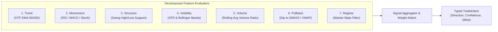

# Strategy Engine & Baseline Specification
## Project: CUANIMUS — Quantitative Signal Architecture

- **Document Version:** 1.0.0
- **Date:** 2026-10-03
- **Status:** APPROVED

---

## 1. V0 Baseline Architecture Audit (Reverse-Engineered from Codebase)

The baseline strategy currently deployed in the repository is reconstructed as **V0 / BASELINE** from [`user_data/strategies/sniper_trade.py`](file:///home/zero/ai-gemini-futures-bot/user_data/strategies/sniper_trade.py) and [`user_data/config_agresif.json`](file:///home/zero/ai-gemini-futures-bot/user_data/config_agresif.json):

### 1.1 Baseline Parameters (V0)
- **Strategy Identifier:** `SNIPER_TRADE` (v0.1)
- **Timeframe:** `15m`
- **Pairs Traded:** `XRP/USDT:USDT`, `ETH/USDT:USDT`, `ADA/USDT:USDT`
- **Max Open Positions:** `3`
- **Trading Mode:** Binance Futures (USDT-M, Isolated Margin)
- **Leverage:** Fixed `5.0x` (hardcoded in `leverage()` hook)
- **Stake Allocation:** Fixed `10.0 USDT` per trade (hardcoded in `custom_stake_amount()`)
- **Stop Loss:** Static `-0.015` (-1.5% price movement; corresponds to $-7.5\%$ on 5x margin)
- **Minimal ROI:** `{"0": 0.030, "30": 0.020, "60": 0.010, "120": 0}` (exits at break-even after 2 hours)
- **Trailing Stop:** Enabled (`positive: 0.01`, `offset: 0.018`, `only_offset_is_reached: true`)
- **Execution Type:** Limit order at top of order book (`entry_pricing: {price_side: "same", use_order_book: true, order_book_top: 1}`)
- **Unfilled Timeout:** **None configured** (leads to indefinite order lock-up)

### 1.2 Baseline Entry Logic (V0)
```text
LONG Signal Trigger:
  - Market Bias != "BEARISH" with confidence >= 70
  - BTC 1h RSI < 70 AND ETH 1h RSI < 70
  - Local Trend: EMA(20) > EMA(50) * 1.003
  - Momentum: RSI(14) > 62
  - Trend Strength: ADX(14) > 25

SHORT Signal Trigger:
  - Market Bias != "BULLISH" with confidence >= 70
  - BTC 1h RSI > 30 AND ETH 1h RSI > 30
  - Local Trend: EMA(20) < EMA(50) * 0.997
  - Momentum: RSI(14) < 38 AND RSI(14) > 30
  - Trend Strength: ADX(14) > 25
```

### 1.3 Baseline Structural Flaws
1. **Late Breakout FOMO:** Requiring `RSI > 62` when `EMA20 > EMA50` enters trades at the upper extreme of 15m oscillations, right before mean-reverting pullbacks.
2. **Noise-Zone Stop Loss:** Static -1.5% SL is narrower than the normal 15m ATR range of ADA/XRP/ETH, causing **61.39% of all trades to be stopped out by market noise**.
3. **Negative ROI Decay:** Exiting trades at 0.0% gain after 120 minutes produces a net realized loss due to roundtrip taker/maker fees (approx. 0.08% - 0.10% notional).
4. **AI Signal Dead Code:** Lines 438-442 in `sniper_trade.py` print a log when AI approves LONG, but omit `long_signal = True`.

---

## 2. Target Strategy Engine Architecture (V1+)

The target architecture replaces monolithic logic with a **Composable Multi-Feature Pipeline**:



### 2.1 Feature Definitions
1. **Trend Feature:** Directional bias determined across multiple timeframes (15m local, 1h intermediate, 4h macro).
2. **Pullback Feature:** Enforces entry on *retracements* towards value zones (e.g., test of rising EMA20 or 50% candle retrace with StochRSI < 30) rather than buying extended green candles.
3. **Structure Feature:** Validates local support/resistance levels. Stop loss must be placed structurally behind swing highs/lows.
4. **Volatility Feature (ATR):** Measures market noise to scale stop loss and profit targets dynamically.
5. **Volume Confirmation:** Order volume must be $\ge 1.2 \times$ 20-period moving average to filter low-liquidity fakeouts.
6. **Regime Gating:** Trading is immediately inhibited if the market regime is classified as `RANGING` or `HIGH_VOLATILITY_CHOP`.

### 2.2 Strategy Abstract Contract (`BaseStrategy`)
```python
from abc import ABC, abstractmethod
import pandas as pd
from cuanimus.common.types import TradeIntent, MarketFrame, RegimeContext

class BaseStrategy(ABC):
    @property
    @abstractmethod
    def strategy_id(self) -> str:
        """Unique strategy name and semantic version (e.g., 'PULLBACK_V1')"""
        pass

    @abstractmethod
    def populate_indicators(self, dataframe: pd.DataFrame, metadata: dict) -> pd.DataFrame:
        """Compute vectorized indicators on raw OHLCV."""
        pass

    @abstractmethod
    def evaluate_intent(self, market_frame: MarketFrame, regime: RegimeContext) -> TradeIntent:
        """
        Evaluate feature matrix and return an immutable TradeIntent.
        Must be a pure function with no side effects.
        """
        pass
```
