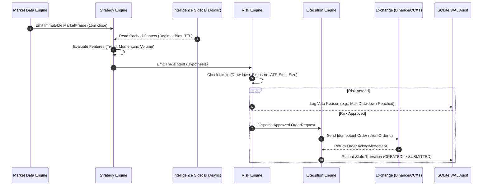

# Trading Engine Specification
## Project: CUANIMUS — Deterministic Execution Engine

- **Document Version:** 1.0.0
- **Date:** 2026-10-03
- **Status:** APPROVED

---

## 1. Engine Purpose & Responsibilities

The **Trading Engine** orchestrates the end-to-end lifecycle of market data processing, strategy signal generation, independent risk approval, and order execution.

---

## 2. Determinism & Timing Invariants

1. **Candle Close Discipline:** Entry signals are strictly computed on closed candle timestamps ($T_{\text{candle}} + \epsilon$), never mid-candle unconfirmed prices.
2. **Zero In-Loop Network Blocking:** All internal operations (indicator evaluation, feature matrix construction, risk vetting) execute synchronously within $< 50\text{ ms}$. External API calls (e.g. Gemini LLM) are prohibited inside this loop.
3. **State Recovery Invariant:** On engine startup or restart, the engine reconciles local database orders against exchange open orders prior to accepting new intents.

---

## 3. Concurrency & Multi-Pair Coordination

- **Single Worker Thread per Core Pipeline:** Ensures race-condition-free state transitions for portfolio balance and shared exposure budgets.
- **Asynchronous Data Feeds:** WebSocket order book and ticker updates run on an asyncio event loop, populating double-buffered memory arrays read atomically by the execution loop.
- **Partitioned Capital Allocation:** Capital limits are enforced across the entire portfolio:
  $$\sum_{i=1}^{N} \text{Exposure}_i \le \text{Total Capital} \times \text{Tradable Balance Ratio}$$
