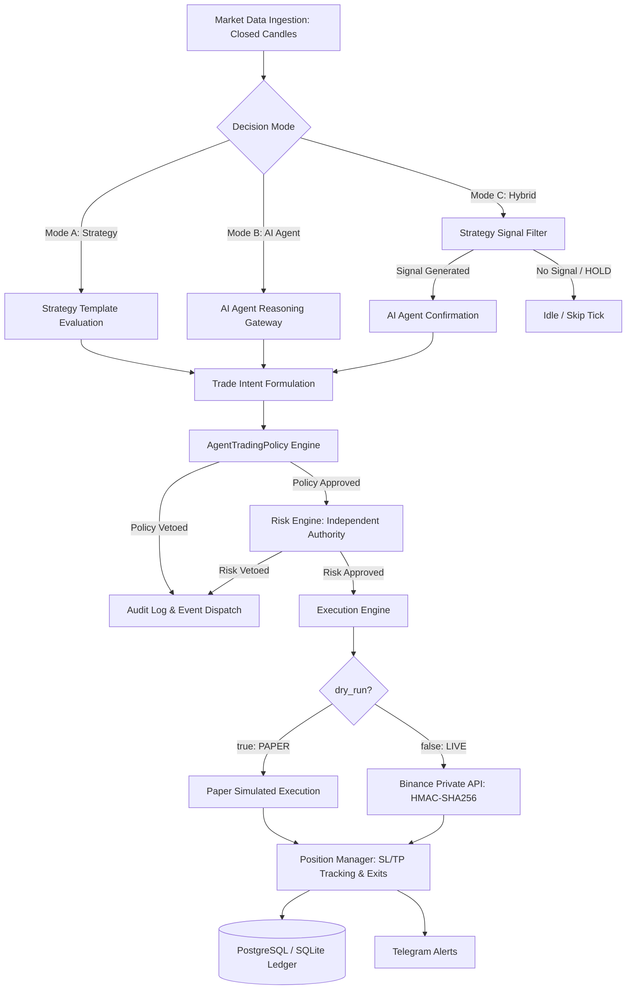

# Trading Engine Specification
## Project: CUANIMUS — Autonomous Execution Engine & Trading Profiles

- **Document Version:** 2.0.0
- **Date:** 2026-10-07
- **Status:** APPROVED & IMPLEMENTED

---

## 1. Engine Purpose & Responsibilities

The **CUANIMUS Autonomous Trading Engine** orchestrates continuous, real-time background market monitoring, quantitative strategy evaluation, AI Agent reasoning, independent risk vetting, and order execution.



---

## 2. Three Official Decision Modes

CUANIMUS formalizes three distinct paths for autonomous trade generation. In all modes, neither Strategy nor AI ever contacts the exchange directly—all trades must pass through Policy, Risk Engine, and Execution Engine.

### MODE A — Strategy Autotrade (Pure Quantitative Template)
* **Pipeline:** `Market Data (Closed Candle) -> Strategy Evaluation -> Risk Engine -> Execution Engine`
* **Characteristics:** 100% deterministic, low latency (< 15ms), zero LLM token consumption.
* **Strategies Supported:** `hybrid_v2c`, `pullback_v2a`, `structure_v2b`, `atr_v1`, `baseline_v0`.
* **Signal Triggers:** Indicators evaluate strictly on finalized candle closes.

### MODE B — AI Agent Autotrade (AI Decision Maker)
* **Pipeline:** `Market Context -> AI Agent Gateway -> Structured Decision JSON -> Policy Engine -> Risk Engine -> Execution Engine`
* **Characteristics:** AI analyzes multi-timeframe context, volatility regime, order block liquidity, and macro factors.
* **Constraints:** Must return typed JSON adhering to `AiTradeDecisionSchema`. Evaluated strictly against `AgentTradingPolicy` boundaries before reaching RiskEngine.

### MODE C — Hybrid Autotrade (Strategy Filter + AI Decision Maker)
* **Pipeline:** `Market Data -> Strategy Filter -> AI Confirmation -> Policy Engine -> Risk Engine -> Execution Engine`
* **Characteristics:** The quantitative strategy acts as a sentinel filter. If the strategy emits `HOLD`, the tick concludes with zero AI tokens spent. If `BUY`/`SELL` setup is detected, the AI Agent is invoked to confirm or reject the setup based on higher-timeframe confluence.

---

## 3. Trading Profiles Architecture

Trading automation is configured via **Trading Profiles** rather than low-level technical worker scripts:

```yaml
profile_id: prof_ada_15m
name: ADA Futures Momentum
symbol: ADA/USDT:USDT
timeframe: 15m
decision_mode: hybrid       # strategy | agent | hybrid
strategy_id: hybrid_v2c
agent_id: cuanimus_analyst
risk_profile: conservative  # conservative (0.5%) | balanced (1.0%) | aggressive (1.5%)
execution_mode: paper       # paper | testnet | live
max_open_positions: 1
cooldown_minutes: 30
is_active: true
```

### Profile Lifecycle States:
* **`CREATED`**: Persisted in SQLite/PostgreSQL store.
* **`RUNNING`**: Active in continuous evaluation loop.
* **`PAUSED`**: Temporarily suspended by operator.
* **`STOPPED`**: Terminated and session finalized.

---

## 4. Determinism & Timing Invariants

1. **Strict Closed-Candle Idempotency:** Signals are evaluated strictly on finalized closed candles ($T_{\text{candle}} + \epsilon$). The engine persists `last_evaluated_candle_ts`. If the latest fetched candle timestamp matches the recorded timestamp, the evaluation tick skips immediately.
2. **Zero Future Leakage:** Strategies and backtests evaluate bar-by-bar causal data without future MAE/MFE visibility.
3. **Dynamic SL/TP Tracking:** The `PositionManager` continuously monitors live mark prices on every tick. When mark price crosses Stop Loss or Take Profit targets, an automatic market exit order is dispatched, calculating realized PnL and updating ledger records.
4. **Manual Operator Intervention:** The engine allows operators to close positions on demand (`close_position_by_id`) or cancel open limit orders (`cancel_order`) without breaking automated engine invariants.

---

## 5. Freqtrade-Style Simple Dry Run / Live Switch

CUANIMUS adopts the clean, industry-standard configuration pattern:

* **`dry_run: true`**: All orders execute inside the simulated paper engine. Zero risk to real funds.
* **`dry_run: false`**: Orders execute against the configured exchange environment (Binance Testnet or Binance Live) using HMAC-SHA256 authenticated private endpoints.

---

## 6. Concurrency & Safety Controls

* **Global Emergency Kill Switch:** Immediate human or flash-crash trigger halting all running profile sessions and locking `RiskEngine` against new intent approvals.
* **Circuit Breaker:** Automatic lockout if portfolio drawdown exceeds 15% or daily loss exceeds 3%.
* **Audit Trail:** Every evaluation tick, intent generation, risk approval, and fill is permanently recorded in `logs/agent_audit.jsonl` and database orders table.
