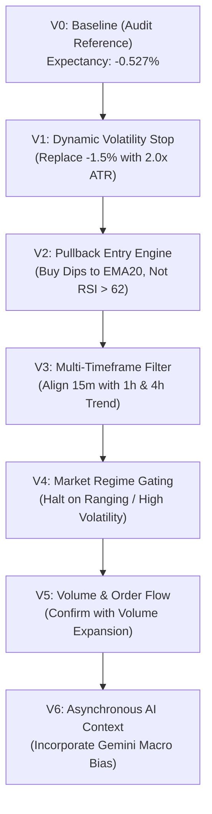

# Backtesting & Baseline Performance Specification
## Project: CUANIMUS — Quantitative Validation Framework

- **Document Version:** 1.0.0
- **Date:** 2026-10-03
- **Status:** APPROVED

---

## 1. Empirical Performance Baseline (V0 / SNIPER_TRADE Audit)

To eliminate speculation, the quantitative baseline was extracted directly from the persistent SQLite database (`/freqtrade/tradesv3.dryrun.sqlite`) covering **733 closed dry-run futures trades** executed between **2026-06-25** and **2026-10-02**:

### 1.1 Complete Baseline Metric Table

| Performance Metric | Empirical Value | Quant Evaluation |
| :--- | :--- | :--- |
| **Total Closed Trades** | **733 Trades** | Statistically significant sample size ($N > 500$). |
| **Win Rate** | **36.83%** (270 W / 463 L) | Severely sub-optimal for a trend breakout approach. |
| **Average Win** | **+1.85%** (+0.1834 USDT) | Truncated by aggressive 2-hour ROI decay. |
| **Average Loss** | **-1.91%** (-0.1896 USDT) | Dominated by fixed -1.5% SL + slippage/fees. |
| **Expectancy (% per trade)** | **-0.527% per trade** | **Negative Mathematical Expectancy**. Guaranteed depletion. |
| **Expectancy (USDT per trade)**| **-0.0522 USDT per trade** | Loses ~5.2 cents per trade on a $10 position. |
| **Profit Factor** | **0.564** | Deeply unprofitable ($< 1.0$; viable target is $> 1.6$). |
| **Initial Capital** | **65.00 USDT** | Configured `dry_run_wallet`. |
| **Final Capital** | **26.73 USDT** | Capital eroded over 3.2 months. |
| **Total Net Return** | **-38.27 USDT (-58.87%)** | System suffered a $> 58\%$ capital loss. |
| **Maximum Drawdown** | **38.09 USDT (58.76%)** | Breached all institutional risk limits. |
| **Max Consecutive Losses** | **13 Consecutive Losses** | Catastrophic streak due to lack of chop regime gating. |
| **Largest Win / Largest Loss** | **+5.39% / -11.28%** | Asymmetric downside outlier caused by gap down. |
| **Average Trade Duration** | **39.3 Minutes (0.65 Hours)**| Rapid churning of orders in noise zone. |
| **Total Turnover** | **7,268.65 USDT** | High churning relative to account balance. |
| **Total Exchange Fees Incurred**| **10.7671 USDT** | Fees devoured **16.56% of initial account capital**! |
| **Total Funding Fees** | **-0.0368 USDT** | Minor net negative due to short hold durations. |

### 1.2 Breakdown by Asset Pair & Direction
```text
            Pair  Side   Trades  Wins  WinRate (%)   Net PnL (USDT)   Avg PnL (%)
   ADA/USDT:USDT  Long      271    96       35.42%         -13.13        -0.49%
   ADA/USDT:USDT Short      123    45       36.59%          -7.58        -0.62%
   ETH/USDT:USDT  Long      145    53       36.55%          -7.27        -0.51%
   ETH/USDT:USDT Short       51    18       35.29%          -3.27        -0.65%
   XRP/USDT:USDT  Long       85    40       47.06%          -1.43        -0.17%
   XRP/USDT:USDT Short       58    18       31.03%          -5.59        -0.97%
```
*Empirical Finding:* **Every single pair and every trading direction lost money under the V0 baseline strategy.**

---

## 2. Event-Driven Backtesting Standards

To prevent the deceptive illusion of backtest profitability ("curve fitting"), the CUANIMUS validation framework enforces strict simulation standards:

1. **Realistic Fee Modeling:**
   - Maker Fee: $0.020\%$ notional
   - Taker Fee: $0.050\%$ notional (futures standard)
   - Margin interest & 8-hour funding rates modeled from historical funding archives.
2. **Conservative Slippage Simulation:**
   - Stop-market orders: Penalized by $0.05\%$ to $0.15\%$ adverse slippage.
   - Limit orders: Only filled if traded price crosses the limit level by at least 1 tick (zero optimistic fill modeling).
3. **Strict Zero-Lookahead Invariant:**
   - Indicator values at index $t$ may only reference data from indices $\le t-1$ for decisions executed at open of bar $t$.

---

## 3. The Isolated Variable Experiment Framework

> **"Never change six variables simultaneously without attribution."**

Every enhancement hypothesis must progress through a formal, versioned release gate:



### Experiment Metadata Tracking Schema
```yaml
experiment_id: "EXP_V1_DYNAMIC_ATR"
parent_version: "V0_BASELINE"
variable_modified: "stop_loss_mechanism"
parameters:
  atr_period: 14
  atr_multiplier: 2.0
  roi_table: "disabled"
dataset:
  exchange: "binance"
  pairs: ["ADA/USDT:USDT", "ETH/USDT:USDT", "XRP/USDT:USDT"]
  timeframe: "15m"
  date_range: "2026-01-01 to 2026-10-01"
assumptions:
  taker_fee: 0.0005
  slippage: 0.0008
target_metrics:
  expected_profit_factor_min: 1.20
  max_drawdown_ceiling: 20.0%
```
