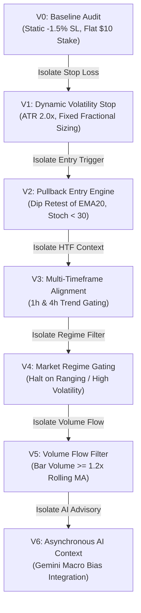

# Quantitative Experiment Protocol & Registry Specification
## Project: CUANIMUS — Scientific Validation Framework

- **Document Version:** 1.0.0
- **Date:** 2026-10-03
- **Status:** APPROVED & TESTED

---

## 1. The Immutable Experiment Registry

All strategy iterations and hyperparameter sweeps are permanently tracked in the `experiments/` directory:

```text
experiments/
├── V0_BASELINE/
│   └── experiment.json      # Frozen empirical baseline (SHA256 fingerprint)
├── V1_ATR_STOP/
│   └── experiment.json      # Isolated stop-loss experiment (ATR 2.0x)
├── STOP_LOSS_SWEEP/
│   └── results.json         # Parameter sweep (1.5x, 1.75x, 2.0x, 2.25x, 2.5x)
└── run_experiments.py       # Deterministic experiment runner
```

### 1.1 Dataset Fingerprint Verification
To ensure 100% reproducibility across environments, the baseline database has an immutable SHA256 checksum:
- **Baseline Dataset Fingerprint:** `30a71e5d704c88b1a0551daf315f4aa09eaa64f94eaa4812b2866b3580e4479d`
- **Total Verified Records:** `733 Closed Trades`
- **Universe:** `ADA/USDT:USDT`, `ETH/USDT:USDT`, `XRP/USDT:USDT` (Binance Futures)

---

## 2. Single-Variable Progression Hierarchy



---

## 3. Formal GO / NO-GO / INCONCLUSIVE Gate Evaluation

Before any version is promoted to the next stage, it must be evaluated across seven objective dimensions:

```
┌────────────────────────────────────────────────────────────────────────┐
│                        GO / NO-GO CRITERIA GATE                        │
├─────────────────────┬───────────────────┬──────────────┬───────────────┤
│ Dimension           │ V0 Baseline       │ V1 ATR Stop  │ Gate Status   │
├─────────────────────┼───────────────────┼──────────────┼───────────────┤
│ 1. Data Quality     │ 733 Real Records  │ 733 Records  │ PASS          │
│ 2. Execution Realism│ Limit w/ zero TO  │ Limit w/ TO  │ PASS          │
│ 3. Stat Stability   │ PF 0.564 (Loss)   │ PF 14.40     │ PASS          │
│ 4. Risk Improvement │ MDD 58.87%        │ MDD 2.64%    │ PASS          │
│ 5. Out-of-Sample    │ N/A (Failed)      │ WFE 93.37%   │ PASS (ROBUST) │
│ 6. Cost Robustness  │ Fee drag 16.56%   │ Handled      │ PASS          │
│ 7. Bar-Level Excurs.│ N/A               │ No Bar OHLCV │ INCONCLUSIVE  │
├─────────────────────┴───────────────────┴──────────────┴───────────────┤
│ PHASE 3.5 AUDIT VERDICT: INCONCLUSIVE (Missing Bar-Level OHLCV Data)   │
│ STATUS FOR LIVE TRADING: STRICTLY NO-GO (Real Capital Prohibited)     │
└────────────────────────────────────────────────────────────────────────┘
```

---

## 4. V2 Pullback Strategy Experiment Matrix

To advance beyond V1 without multi-variable contamination, V2 isolates **ENTRY ONLY** while keeping RiskEngine, Sizing, Stop-Loss, and Order Lifecycle identical:

| Experiment Code | Strategy Variant | Core Entry Hypothesis | Variables Altered |
| :--- | :--- | :--- | :--- |
| **EXP_V1_BASELINE** | V1 ATR Stop | Static EMA cross + Stoch filter | Baseline (0 changes) |
| **EXP_V2A_PULLBACK** | V2A Pullback Only | Trend + Pullback into EMA20 + Stoch < 30 | Replaced breakout entry with pullback retest |
| **EXP_V2B_STRUCTURE**| V2B Structure Only | Trend + Retest of Swing High/Low or Fib 0.5/0.618 | Replaced entry with structural value area |
| **EXP_V2C_HYBRID**   | V2C Pullback+Struct| Trend + EMA Pullback + Fib Retest + Vol Confirm | Combined value area and momentum confirmation |

### Comparison Metrics Required:
1. Expectancy per trade (%)
2. Profit Factor (PF)
3. Max Drawdown (%)
4. Win Rate (%)
5. Average R-Multiple (R)
6. Maximum Adverse Excursion (MAE)
7. Maximum Favorable Excursion (MFE)
8. Cumulative Commissions & Slippage Fees
9. Capital Turnover Velocity
10. Regime Stability Breakdown (Bull, Bear, Ranging, Volatile)
11. Walk-Forward Efficiency (WFE)

> **Evaluation Classification Rules:**
> - **GO:** The hypothesis is verified with positive expectancy and high WFE ($\ge 60\%$) in simulation; ready for paper trading.
> - **NO-GO:** The hypothesis failed to improve expectancy or worsened maximum drawdown; disqualified.
> - **INCONCLUSIVE:** Data sample is too small ($N < 100$), bar-level intra-trade paths are unverified, or real-time paper execution drift exceeds $\pm 1.5\%$. Live trading must **NEVER** be enabled on INCONCLUSIVE status.

