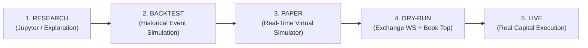

# Paper Trading & Live Progression Specification
## Project: CUANIMUS — Production Readiness Gate

- **Document Version:** 1.0.0
- **Date:** 2026-10-03
- **Status:** APPROVED

---

## 1. Five-Stage Promotion Pipeline

Capital must never be risked on unverified code. A strategy or algorithm must advance through five strict promotional stages before live deployment:

---

## 2. Gate Criteria for Promotion

### Gate 1: Research to Backtest
- Hypothesis formulated with economic/market rationale (e.g. liquidity sweep, trend pullback).
- Parameter boundaries defined before looking at data.

### Gate 2: Backtest to Paper / Dry-Run
- Out-of-Sample Walk-Forward Efficiency $\text{WFE} \ge 60\%$.
- Maximum drawdown $\le 15.0\%$ under conservative fee and slippage models.
- Profit Factor $\ge 1.40$ over at least 300 simulated trades.
- Zero lookahead errors confirmed via automated data auditing.

### Gate 3: Dry-Run to Live Trading
- **Minimum Duration:** 30 consecutive calendar days of automated operation in `DRY-RUN`.
- **Trade Volume:** Minimum 100 executed dry-run trades.
- **Slippage & Discrepancy Audit:** Execution prices must deviate by less than $\pm 0.08\%$ from the simulated backtest prices on identical candle closes.
- **Zero Unhandled Exceptions:** Zero crashes, zero database locks, and zero hanging orders in system logs.
- **Explicit Multi-Stage Operator Sign-Off:** Configuration flags set and confirmed via `.env`.

---

## 3. Discrepancy Tracking (Paper vs Backtest)

The platform logs a metric called the **Implementation Shortfall Metric ($I_{\text{shortfall}}$)**:

\[
I_{\text{shortfall}} = \text{PnL}_{\text{backtest\_expected}} - \text{PnL}_{\text{dryrun\_actual}}
\]

### Sources of Implementation Shortfall:
1. **Queue Position Latency:** Limit orders filled in backtest but left behind by exchange order book in real-time.
2. **Adverse Slippage on Market Stop Loss:** Stop orders executed during high-volatility wicks at prices worse than candle close.
3. **Exchange WebSocket Feed Drops:** Missed ticks causing late signal triggers.

If $I_{\text{shortfall}} > 1.5\%$ per month, the strategy is automatically demoted back to research for slippage model recalibration.

---

## 4. Paper Trading Safety Architecture (`cuanimus/execution/paper_safety.py`)

To ensure real capital is never risked accidentally:
1. **Hardcoded Safety Interceptor:** The `PaperExecutionSafetyGuard` asserts that `dry_run == True`. If any code path attempts to submit a live order or sign an authenticated live payload, it immediately raises a `FatalSafetyViolationError`.
2. **Automated Safety Test:** Continuous integration runs `tests/test_paper_trading_safety.py` on every commit, verifying that `PAPER MODE -> NEVER CALL REAL ORDER SUBMIT`.

---

## 5. Live Market & Paper Execution Telemetry (20 Core Metrics)

During paper trading, the platform logs the following 20 execution metrics:
1. `signal_latency_ms`: Time from candle close to signal generation.
2. `decision_latency_ms`: Time taken by RiskEngine to evaluate signal.
3. `order_submission_latency_ms`: Time from approval to exchange submission.
4. `exchange_response_latency_ms`: Roundtrip network latency from exchange API.
5. `limit_orders_submitted`: Total limit orders placed.
6. `limit_orders_filled`: Total limit orders executed.
7. `limit_fill_rate_pct`: Ratio of filled to submitted limit orders.
8. `limit_orders_cancelled`: Orders cancelled due to timeout or strategy exit.
9. `limit_cancellation_rate_pct`: Ratio of cancelled to submitted orders.
10. `partial_fills_count`: Executions where available volume was less than order size.
11. `order_rejections_count`: Orders rejected by exchange filters (e.g. min notional).
12. `spread_bps`: Bid-ask spread in basis points at order arrival.
13. `observed_slippage_pct`: Difference between requested price and execution price.
14. `modeled_vs_observed_slippage`: Deviation between backtest assumption (0.05%) and actual slippage.
15. `simulated_funding_fees`: Cumulative 8-hour funding rates accrued.
16. `simulated_trading_fees`: Cumulative maker and taker commissions paid.
17. `missed_signals_count`: Signals dropped due to websocket disconnect or lock contention.
18. `stale_data_events`: Candles arriving with lag > 5 seconds.
19. `clock_drift_events`: Local system clock divergence from exchange server time > 500ms.
20. `risk_engine_veto_count` & `emergency_stop_count`: Interventions by safety circuits.

