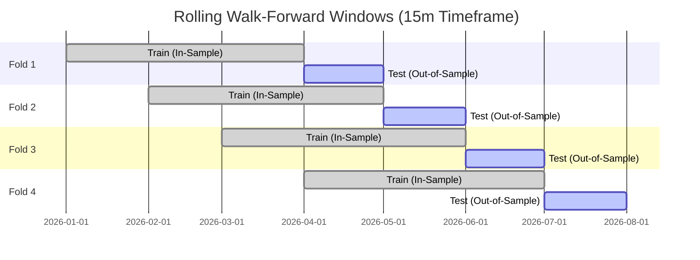

# Walk-Forward Analysis & Out-of-Sample Validation Specification
## Project: CUANIMUS — Quantitative Robustness Framework

- **Document Version:** 1.0.0
- **Date:** 2026-10-03
- **Status:** APPROVED

---

## 1. The Overfitting Dilemma in Quantitative Crypto Trading

A strategy that yields an attractive backtest on historical crypto data almost always suffers from **Data Snooping Bias (Curve Fitting)**. Optimizing parameters (e.g. searching across 50 combinations of RSI and EMA periods) will inevitably find arbitrary numbers that worked by random chance during that specific historical slice.

To establish genuine statistical edge, CUANIMUS mandates **Walk-Forward Analysis (WFA)** and strict **Out-of-Sample (OOS)** validation.

---

## 2. Dataset Splitting Protocol (Train / Validation / Test)

```
┌────────────────────────────────────────────────────────────────────────┐
│                        DATA PARTITIONING SCHEME                        │
├─────────────────────┬────────────────────┬─────────────────────────────┤
│ 1. In-Sample (Train)│ 60% of Dataset     │ Parameter discovery &       │
│                     │                    │ feature optimization.       │
├─────────────────────┼────────────────────┼─────────────────────────────┤
│ 2. Validation       │ 20% of Dataset     │ Model selection &           │
│                     │                    │ hyperparameter tuning.      │
├─────────────────────┼────────────────────┼─────────────────────────────┤
│ 3. Out-of-Sample    │ 20% of Dataset     │ Blind test. Executed ONCE.  │
│    (Test)           │ (Held-out Future)  │ True expectancy benchmark.  │
└─────────────────────┴────────────────────┴─────────────────────────────┘
```

---

## 3. Rolling Walk-Forward Analysis (WFA) Architecture

Instead of a single static split, WFA slides a rolling optimization window across market regimes:



### 3.1 Walk-Forward Efficiency (WFE) Metric

The **Walk-Forward Efficiency (WFE)** quantifies whether an optimized strategy retains its predictive power on unseen data:

\[
\text{WFE} = \frac{\text{Annualized Return}_{\text{Out-of-Sample}}}{\text{Annualized Return}_{\text{In-Sample}}} \times 100\%
\]

- **$\text{WFE} \ge 60\%$:** **Robust Model.** Parameter set generalizes well across market regimes.
- **$40\% \le \text{WFE} < 60\%$:** **Marginal Model.** Requires tighter risk constraints.
- **$\text{WFE} < 40\%$:** **Overfitted (Curve-Fitted). REJECTED.** The strategy has memorized noise.

---

## 4. Parameter Sensitivity & Stability Surface

A robust strategy must demonstrate a **Parameter Plateau** rather than a sharp peak:

```text
Return Surface
      ▲
      │            Robust Plateau (Acceptable)
      │          ┌──────────────────────┐
      │          │                      │
      │   Isolated Peak (Rejected)      │
      │        ▲                        │
      │       ╱ ╲                       │
      │      ╱   ╲                      │
      └─────┴─────┴─────────────────────┴──────► Parameter Value (e.g. ATR Multiplier)
```

- **Rejection Invariant:** If changing a parameter by $\pm 10\%$ (e.g., ATR multiplier from $2.0$ to $2.2$) causes the strategy's profit factor to collapse by $> 40\%$, the parameter is an overfitted anomaly and is disqualified from deployment.
