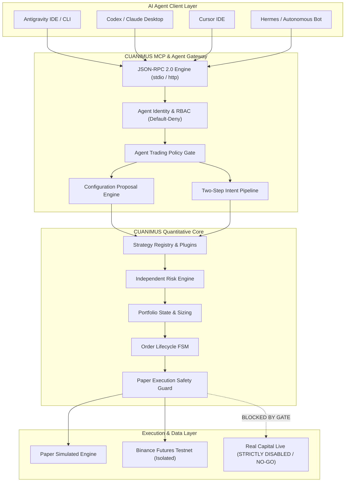
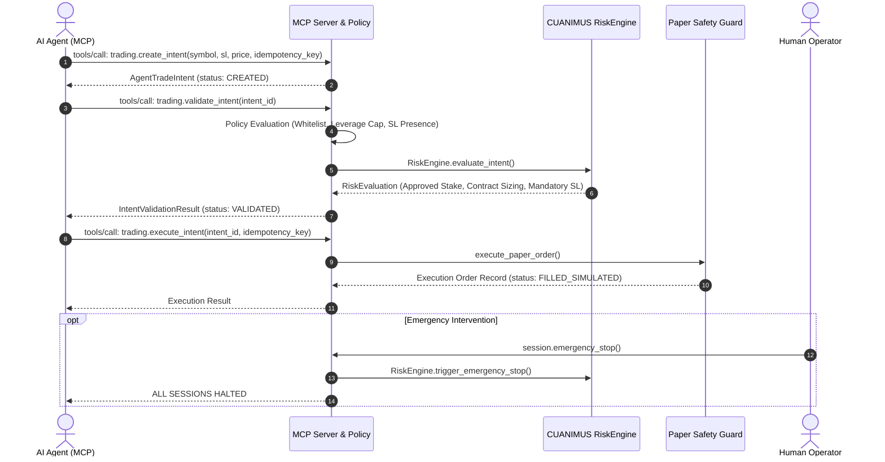

# CUANIMUS Agent Architecture

## 1. Architectural Mission & Invariants

CUANIMUS transforms into an agent-accessible quantitative trading platform where autonomous AI agents (Codex, Antigravity, Claude Desktop, Cursor, Hermes) can understand user intent, assist configuration, inspect market conditions, prepare trades, and execute automated trading in **PAPER** and **TESTNET** modes (`PAPER_AUTO`, `TESTNET_AUTO`).

CUANIMUS retains absolute, final authority over configuration validity, risk guardrails, safety invariants, and execution dispatching.

---

## 2. Decoupling Invariants

1. **No Direct Exchange Access**: Agents NEVER possess exchange API keys or connect directly to Binance sockets/REST endpoints. All requests pass through CUANIMUS MCP tools.
2. **No Direct Database Access**: Agents cannot issue raw SQL queries or alter trade history records.
3. **No Dynamic Python Code Execution**: Agents cannot run `eval()` or `exec()` on the host machine.
4. **Mandatory Two-Step Execution Pipeline**:
   $$\text{Agent Trade Intent} \longrightarrow \text{Schema \& Policy Check} \longrightarrow \text{RiskEngine Assessment} \longrightarrow \text{PaperExecutionSafetyGuard}$$
5. **Single Trading Core**: MCP is strictly an adapter/gateway layer over existing application services, Control Plane API, Strategy Registry, Risk Engine, and Order Lifecycle FSM.

---

## 3. Execution Pipeline Sequence

