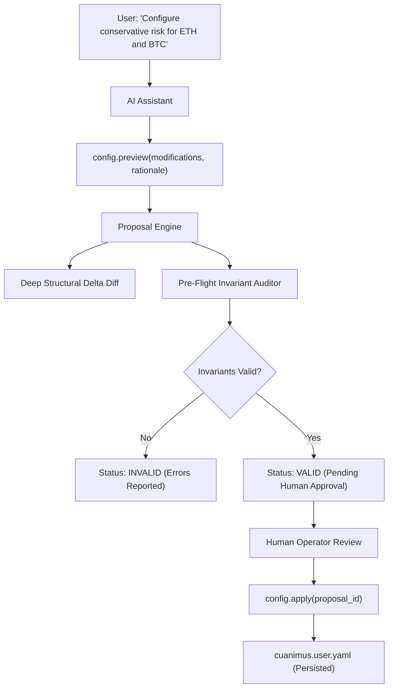

# CUANIMUS Assisted Configuration & Proposal Engine

## 1. Conversational Configuration Workflow

CUANIMUS provides a safe, structured mechanism for AI assistants to help users configure the platform without editing Python core code directly.

---

## 2. Impact Level Classification

Every modified field is classified according to operational risk:

- `SAFE`: Non-critical parameters such as descriptions, logging levels, or cosmetic presets.
- `NOTICE`: Risk limits, capital allocation, cooldown hours, or drawdown thresholds.
- `CRITICAL`: Changes involving live trading flags, stop-loss mechanics, leverage ceilings, or API credentials.

---

## 3. Pre-Flight Safety Verification

Before any proposal is surfaced for approval, `ProposalEngine` instantiates the target configuration and runs `ConfigValidator`. If any invariant is breached (e.g., attempt to enable live trading, leverage $> 10\text{x}$, or disable stop-loss), the proposal is immediately flagged `INVALID` with exact remediation advice.
