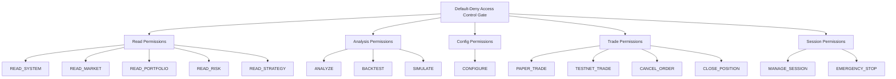

# CUANIMUS Agent Permissions & Default-Deny Security

## 1. Granular Permission Taxonomy

CUANIMUS enforces a strict **Default-Deny** security posture. Agents have no implicit permissions; each capability must be explicitly granted.

---

## 2. Default Permission Mapping by Role

| Permission | ADVISORY | TRADER | RISK_AUDITOR | OPERATOR | SUPERVISOR |
| :--- | :---: | :---: | :---: | :---: | :---: |
| `READ_SYSTEM` | Yes | Yes | Yes | Yes | Yes |
| `READ_MARKET` | Yes | Yes | Yes | Yes | Yes |
| `READ_PORTFOLIO` | Yes | Yes | Yes | Yes | Yes |
| `READ_RISK` | Yes | Yes | Yes | Yes | Yes |
| `READ_STRATEGY` | Yes | Yes | Yes | Yes | Yes |
| `ANALYZE` | Yes | Yes | Yes | No | Yes |
| `BACKTEST` | Yes | No | No | No | Yes |
| `SIMULATE` | Yes | Yes | Yes | No | Yes |
| `CONFIGURE` | Yes | No | No | No | Yes |
| `PAPER_TRADE` | **No** | Yes | **No** | **No** | Yes |
| `TESTNET_TRADE` | **No** | Yes | **No** | **No** | Yes |
| `CANCEL_ORDER` | **No** | Yes | **No** | Yes | Yes |
| `CLOSE_POSITION` | **No** | Yes | **No** | Yes | Yes |
| `MANAGE_SESSION` | **No** | **No** | **No** | Yes | Yes |
| `EMERGENCY_STOP` | **No** | Yes | Yes | Yes | Yes |

---

## 3. Enforcement Failure Handling

When an agent attempts an action without holding the required permission:
1. The call is immediately terminated before reaching the domain handler.
2. An error with code `-32001 (PERMISSION_DENIED)` is returned.
3. A security audit record with status `PERMISSION_DENIED` is written to `logs/agent_audit.jsonl`.
