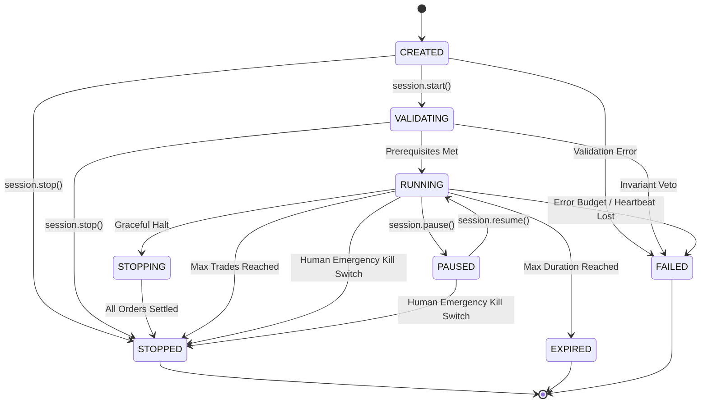

# CUANIMUS Trading Sessions & Lifecycle Automation

## 1. Session State Machine

Autonomous trading runs inside strictly bound sessions managed by `TradingSessionManager`:

---

## 2. Watchdog Protection Mechanisms

1. **Maximum Duration Bound**: Sessions have hard duration limits (default 3600 seconds). When the timer expires, the watchdog transitions the session to `EXPIRED` and cancels all open simulated orders.
2. **Maximum Trade Cap**: Prevents overtrading by halting the session once `max_trades` (default 20) is reached.
3. **Error Budget Protection**: If the agent or network triggers repeated errors exceeding `error_budget` (default 3), the session halts in `FAILED` state to prevent capital erosion.
4. **Agent Heartbeat Monitor**: If the agent fails to send a heartbeat ping within `heartbeat_timeout_seconds` (default 60s), the session automatically fails.
5. **Independent Human Kill Switch**: Operators can trigger `session.emergency_stop()` via CLI or API. This halts all active sessions instantly and locks the Risk Engine without waiting for agent acknowledgment.
